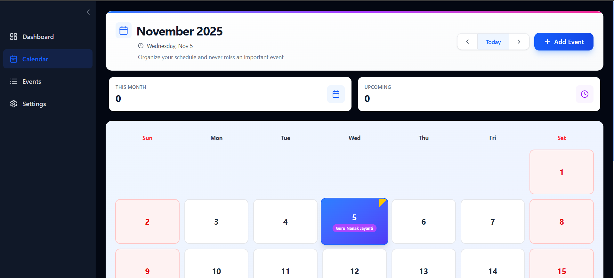
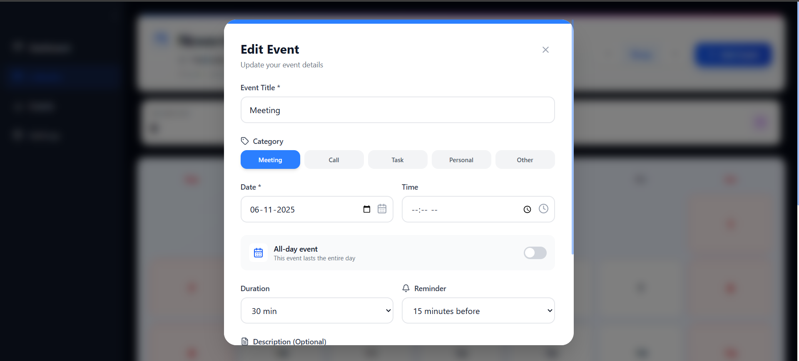
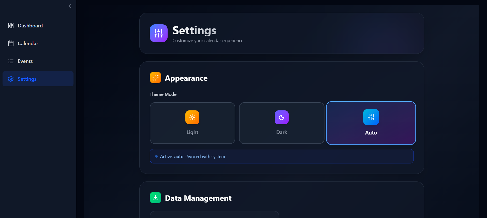

# 🗓️ Responsive Calendar App
A modern, interactive, and fully responsive **Calendar Web App** built with **React.js**, **Vite**, and **Tailwind CSS**. It allows users to **add, edit, delete, and view events** with smart scheduling and automatic **holiday detection** (2024–2029).

## 🚀 Features
- 📅 **Interactive Calendar View** — Displays days, weekends, and national holidays clearly.
- 🧠 **Dynamic Holiday Fetching** — Auto-fetches real Indian holidays (2024–2029) using [Nager.Date API](https://date.nager.at).
- 📝 **Event Management** — Add, edit, or delete events with titles, descriptions, time, and color.
- 🌈 **Custom Themes** — Switch between Light, Dark, and Auto (system-based) themes.
- 🗂️ **Data Persistence** — Events are saved in browser `LocalStorage` (no backend needed).
- 📊 **Dashboard Analytics** — Displays monthly and upcoming event counts.
- ⚙️ **Settings Panel** — Export data, reset calendar, and manage user preferences.
- 📱 **Fully Responsive** — Works smoothly across desktop, tablet, and mobile.
- ⚡ **Fast & Lightweight** — Built using **Vite** for lightning-fast builds and hot reloads.

## 🧰 Tech Stack
| Technology | Purpose |
|-----------:|:--------|
| **React.js** | UI Components & State Management |
| **Tailwind CSS** | Responsive Styling |
| **Vite** | Build Tool & Dev Server |
| **Lucide Icons** | Lightweight Icon Set |
| **LocalStorage API** | Client-side Persistence |
| **Nager.Date API** | Dynamic Holiday Data |

## 🛠️ Installation & Setup

### 1. Clone the repository
    git clone https://github.com/Masthan41/Calendar-app.git
    cd Calendar-app

### 2. Install dependencies
    npm install

### 3. Start the development server
    npm run dev

Then open your browser and navigate to:
    http://localhost:5173

### 🗓️ Calendar View

### ➕ Add Event Modal

### ⚙️ Settings Panel

## 💾 Data Export
All user events can be exported as a `.json` file via the **Settings page** for easy backup or sharing.

## 🔐 Privacy
This app runs completely on the client side. No external database or tracking — all data is stored **locally** in your browser

## 🧑‍💻 Author
**Md Masthan**  
📍 Hyderabad, India  
💼 Aspiring Software Engineer | React Developer | Tech Enthusiast  
[🌐 GitHub](https://github.com/Masthan41) | [💼 LinkedIn](www.linkedin.com/in/md-masthan-6bb310272)
## 🏁 License
This project is open-source under the **MIT License**. Feel free to use, modify, and distribute for personal or educational purposes.
